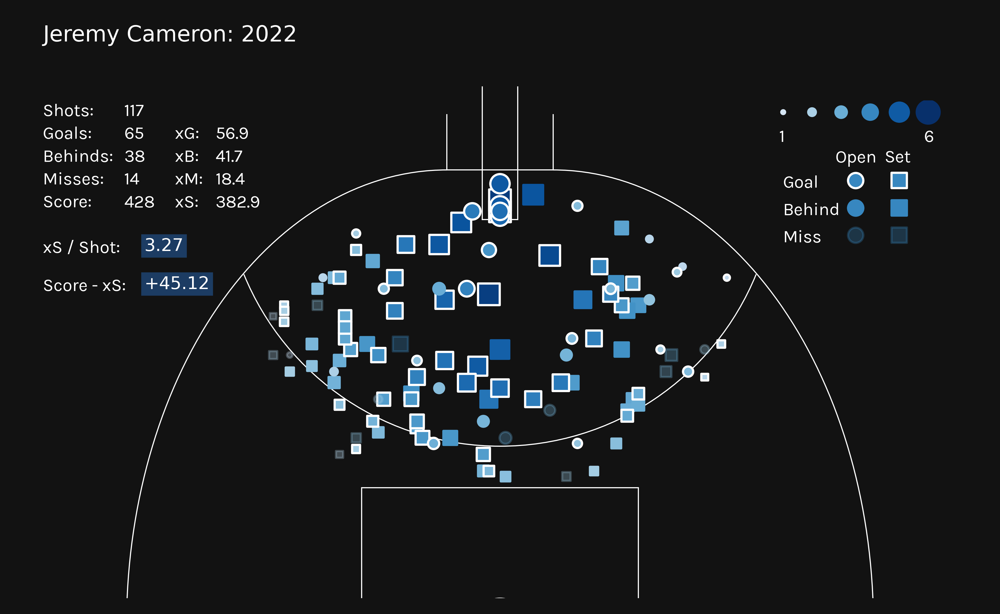

# Expected Score Model

expected-score-model is a Python library with useful functions and notebooks for tuning, training and evaluating multiple XGBoost models to predict the Expected Score of an AFL shot attempt.

There are 6 separate binary classification xgboost models that are combined to create the Expected Score (xScore, xS).

Shots are separated into Open Play & Set shots.

Each of these is used as training data to train 3 binary classification models to predict the probability of a shot being a:
- Goal
- Behind
- Miss

Since each of these models is independent of the other, the probabilities do not necessarily sum to 100%. The probabilities of Goal, Behind and Miss are normalised to 100% before calculating the Expected Score.

Expected Score = Goal%* 6 + Behind%

There have been a few iterations, with varying successes. This is an ongoing project and problem to improve upon incrementally. But the aim of this project is to better understand the game of AFL using Expected notions rather an purely outcome based stats.

The Exepcted Scores will be used to create further metrics and deeper analysis to better understand the game.

## Installation

```python
git clone https://github.com/ciaran-grant/expected-score-model.git
```

## Usage

See notebooks folder for more comprehensive examples of usage.

Open shots and Set shots have their own folders, each with model_building and model_evaluation notebooks for Goals, Behinds, Miss respectively.

### Model Building
TBD

### Model Evaluation
TBD

### Analysis

#### Rolling Averages


#### Shot Maps



## Credits
Data sourced using a private R package. Credits to dgt23.

## CONTRIBUTING
I am currently working on this project so any bugs or suggestions are very welcome. Please contact me or create a pull request.

## License

[MIT](https://choosealicense.com/licenses/mit/)


