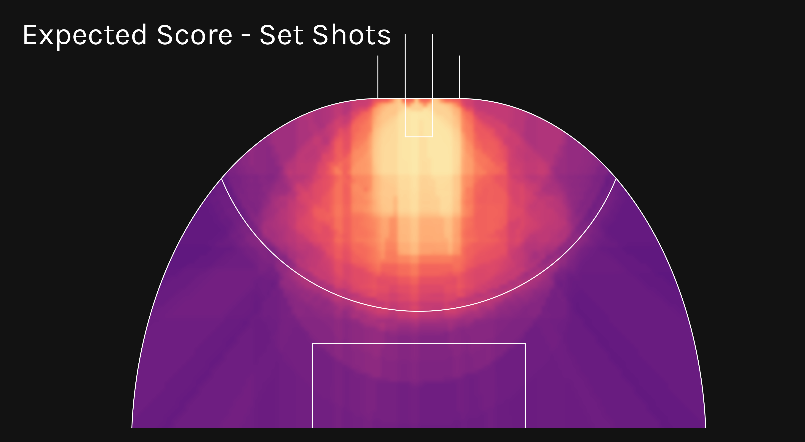
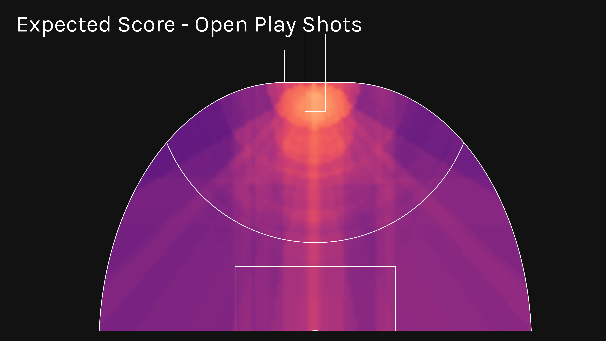
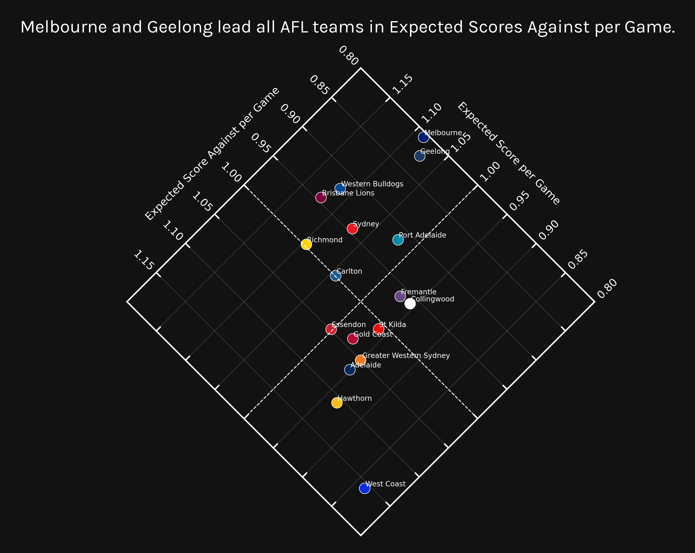
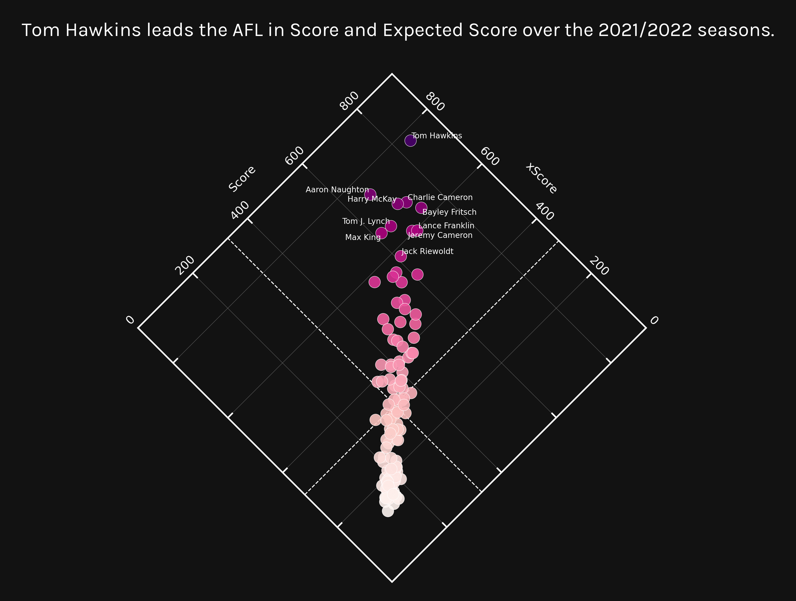
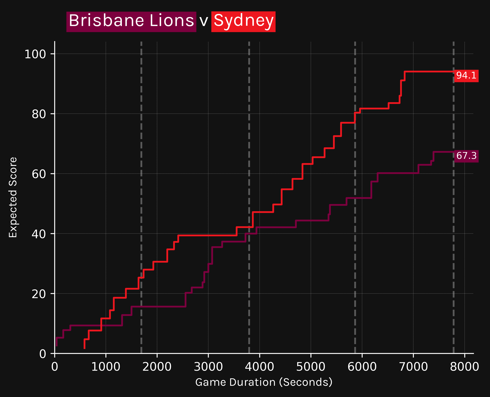
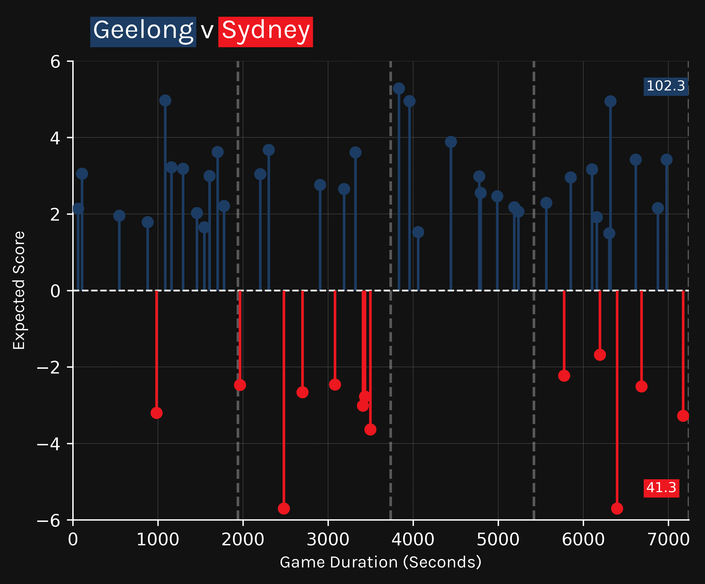

# Expected Score Model

expected-score-model is a Python library with useful functions and notebooks for tuning, training and evaluating multiple XGBoost models to predict the Expected Score of an AFL shot attempt.

There are 6 separate binary classification xgboost models that are combined to create the Expected Score (xScore, xS).

Shots are separated into Open Play & Set shots.

Each of these is used as training data to train 3 binary classification models to predict the probability of a shot being a:
- Goal
- Behind
- Miss

Since each of these models is independent of the other, the probabilities do not necessarily sum to 100%. The probabilities of Goal, Behind and Miss are normalised to 100% before calculating the Expected Score.

Expected Score = Goal%* 6 + Behind%

There have been a few iterations, with varying successes. This is an ongoing project and problem to improve upon incrementally. But the aim of this project is to better understand the game of AFL using Expected notions rather an purely outcome based stats.

The Exepcted Scores will be used to create further metrics and deeper analysis to better understand the game.

## Installation

```python
git clone https://github.com/ciaran-grant/expected-score-model.git
```

## Usage

See notebooks folder for more comprehensive examples of usage.

Open shots and Set shots have their own folders, each with model_building and model_evaluation notebooks for Goals, Behinds, Miss respectively.

### Model Building


#### Models
Model building follows a similar structure across all 6 models. They are all XGBoost models with "binary:logistic" as the family. There are 6 separate models:
- open_shots/behinds
- open_shots/goals
- open_shots/miss
- set_shots/behinds
- set_shots/goals
- set_shots/miss

#### Features
The features for each model are all mainly location based, with open play models considering more context around the shots such as previous actions.

#### Hyperparameter Tuning
Hyperparameters are selected using Optuna hyperparameter tuning process using cross validation within the training set. 

#### Model Fit
The final model is trained on the full training set with the best hyperparameters to be evaluated on the test set. The error metric used currently is log-loss since we want the model probabilities to be as accurate as possible rather than just the classification. We could consider using brier score as the error metric as well, this may remove the need for calibration step below.

#### Calibration
XGBoost predictions with "binary:logistic" outputs are probabilities. These probabilities should accuractely reflect the observed probabilities in the data, this is what calibration ensures.

I have used BetaCalibration here, maybe other calibration techniques are more appropriate but I haven't checked.

#### Saving Predictions and Models
Predictions and the features used for the training and test data are saved down for use in the Model Evaluation. Previous model versions and predictions can be used for comparison to new models.


### Model Evaluation

Main model evaluation metrics looked at for binary classification here are logloss and brier loss score since we are mainly interested in getting accurate probabilities.

Getting accurate average predictions are also a useful guide, but mainly interested in getting the most accurate calibrated probabilities.

For model interpretation and feature importance, there are SHAP Summary Plots and also Feature AvEs for every feature in the model.

Then finally we also have a calibration plot to check how calibrated the models are. When they predict a goal = 50%, do they actually see 50% of them be a goal?

### Expected Score

Once happy with each individual model performance for now, we combine all 6 models to calculate the Expected Score for each shot.

Since each model was trained independently, there is no guarantee that the Goal% + Behind% + Miss% = 1. In fact, they don't. So we normalise each probability as the proportion of the sum of all probabilities to get the appropriate probability of each outcome.

Eg. Goal% = 50%, Behind% = 30%, Miss% = 40%. Total% = 120% (which isn't possible)

Converts to Goal%_Normalised = 50/120 = 42%, Behind%_Normalised = 30/120 = 25%, Miss%_Normalised = 40/120 = 33%

Open play shots will use the open models and the set shots will use the set models.

Expected Score = 6*Goal% + Behind%





### Analysis

#### Rolling Averages


#### Shot Maps


#### Diamond Scatter Plots





#### Match Storytelling - Step / Lollipop Plots





## Credits
Data sourced using a private R package. Credits to dgt23.

## CONTRIBUTING
I am currently working on this project so any bugs or suggestions are very welcome. Please contact me or create a pull request.

## License

[MIT](https://choosealicense.com/licenses/mit/)


