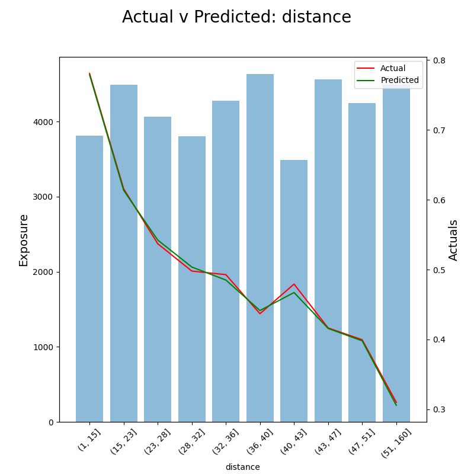
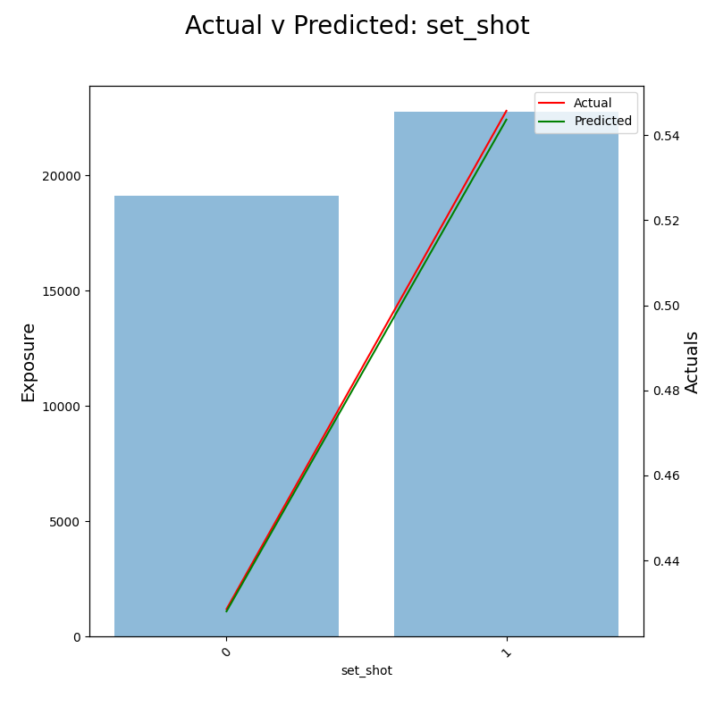

# Expected Score Model

expected-score-model is a Python package with useful functions and notebooks for tuning, training and evaluating various model types to predict the Expected Score of an AFL shot using the context from match chain (events) data.

Expected Score is a measure of shot quality. Using a model to predict the probability of each shot being [Goal, Behind, Miss] allows the computation shown below.

    Expected Score = (Goal Probability %) * 6 + (Behind Probability %)

Similar to Expected Goals in soccer, Expected Score measures the quality of a shot based on the context of the shot itself rather than purely the outcome.

Due to variance in the outcomes of shots, expected metrics have been known to be more predictive of future performance than actual outcomes. This means it can be used as another measuring stick for underlying performance alongside actual outcomes.

Teams who generate more and higher quality shots are more likely to score more points. We know how many shots a team takes, expected score adds the other dimension to meaasure the quality of those shots. 

Intuitively, 10 shots from the goal square are preferrable to 10 shots from 50. 

There have been a few iterations, with varying successes. This is an ongoing project and problem to improve upon incrementally. But the aim of this project is to better understand the game of AFL using Expected notions rather an purely outcome based stats.

The Exepcted Scores will be used to create further metrics and deeper analysis to better understand the game.

Latest version of the model is a multiclassification model to predict the probability of goal, behind and miss. The Expected Score is calculated from these.

## Usage

See notebooks folder for more comprehensive examples of usage.

### Model Building

#### Models
There are multiclassification models for the following model types:
- XGBoost
- Catboost
- MLP
- Logistic Regression

#### Features
The features for each model are mainly location based, with some information for previous actions to provide some context to the shot. 

There are only 4 features in the latest model, however a variety of spatial and contextual chain data has been considered.
- Distance
- Angle
- Set Shot
- Distance since last action

#### Hyperparameter Tuning
Hyperparameters are selected using Optuna hyperparameter tuning process using cross validation within the training set. 

#### Model Fit
The final model is trained on the full training set with the best hyperparameters to be evaluated on the test set. The error metric used currently is log-loss since we want the model probabilities to be as accurate as possible rather than just the classification. We could consider using brier score as the error metric as well, this may remove the need for a calibration step below however CatBoost models are well calibrated already.

#### Calibration
The outputs of each model will be class probabilities, however these probabilities might not align with the observed frequency of each label so we may need to calibrate some models.

CatBoost models are already well calibrated so no further calibration needed here.

#### Saving Predictions and Models
Predictions and the features used for the training and test data are saved down for use in the Model Evaluation. Previous model versions and predictions can be used for comparison to new models.

### Model Evaluation

Main model evaluation metrics looked at for multiclass classification here are logloss and brier loss score since we are interested in getting accurate probabilities.

Getting accurate average predictions are also a useful guide, but mainly interested in getting the most accurate calibrated probabilities.

For model interpretation and feature importance, there are SHAP Summary Plots and also Feature AvEs for every feature in the model.

#### SHAP

#### Feature AvE

Distance

Set Shot

Angle

Distance Since Last Action

#### Calibration

Then finally we also have a calibration plot to check how calibrated the models are. When they predict a goal = 50%, do they actually see 50% of them be a goal?

### Expected Score

Once happy with model performance, we can calculate the Expected Score for each shot.

Expected Score = 6*Goal% + Behind%

### Analysis

#### Rolling Averages

## Credits
Data sourced using a private R package. Credits to dgt23.

## CONTRIBUTING
I am currently working on this project so any bugs or suggestions are very welcome. Please contact me or create a pull request.

## License

[MIT](https://choosealicense.com/licenses/mit/)

